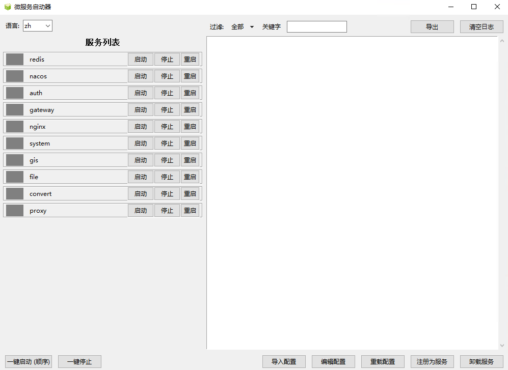

<div align="center">
# MicroService Launcher

基于 Python + Tkinter 的图形化微服务启动与监控工具

[](https://www.python.org/)
[](#)
[](#)
[](#)

</div>


---

## 目录
- [简介](#简介)
- [功能特性](#功能特性)
- [环境要求](#环境要求)
- [快速开始](#快速开始)
- [服务配置](#服务配置)
- [一键打包 EXE](#一键打包-exe)
- [作为 Windows 服务运行](#作为-windows-服务运行)
- [界面截图](#界面截图)
- [项目结构](#项目结构)
- [常见问题](#常见问题)

## 简介
MicroService Launcher 提供一站式的本地微服务编排、健康检查与日志查看能力，适合多模块项目的本地开发联调与演示。通过直观的桌面界面统一管理多个服务的启动、停止、状态与日志。

设计初衷：因历史原因，我项目必须运行在 Windows环境下。但是，常见的 Windows 服务管理工具对“微服务依赖顺序启动”和“健康检查等待”的支持不足。为解决这些具体问题，我参考 Docker Compose 的配置方式，做了一个适配 Windows 的小工具：用声明式配置描述依赖与健康检查，配合简单 GUI 完成有序启动与状态展示。

## 功能特性
- 可视化管理：展示服务状态（运行中、停止、异常、启动中）
- 顺序启动：按依赖与健康状态自动控制启动顺序
- 健康监测：支持 TCP 端口与 HTTP 接口探测
- 自动重启：异常退出后自动尝试重启（可配置次数与间隔）
- 日志管理：实时采集、筛选、查看与导出，按日切割保留最近 7 天

## 环境要求
- Windows 操作系统
- Python 3.12 及以上
- 依赖：psutil、requests、pywin32（详见 [requirements.txt](file:///d:/research/microservice_launcher/requirements.txt)）

## 快速开始
- 安装依赖

```bash
pip install -r requirements.txt
```

- 启动应用

```bash
python src/main.py
```

## 服务配置
- 配置文件位于 `conf/` 目录，建议复制示例为你的本地配置：
  - 将 [services.example.json](file:///d:/research/microservice_launcher/conf/services.example.json) 复制为 `conf/services.json`
- 字段说明与示例

```json
{
  "services": [
    {
      "service_name": "示例服务A",
      "command": "D:/path/to/start.bat",
      "working_dir": "D:/path/to",
      "environment": {
        "PORT": "8080",
        "DEBUG": "1"
      },
      "health_check_type": "port",          // 支持: port | http | none
      "health_check_config": {
        "host": "127.0.0.1",
        "port": 8080,
        "retries": 30,
        "interval": 1,
        "start_period": 5
      },
      "restart": "always",                  // always | unless-stopped | on-failure
      "max_restart_times": 5,
      "restart_interval": 3
    }
  ]
}
```

## 一键打包 EXE
- 推荐使用脚本完成本地打包，自动准备虚拟环境、安装依赖并生成 `dist/MicroServiceLauncher.exe`
  - 运行脚本：[build_exe.bat](file:///d:/research/microservice_launcher/scripts/build_exe.bat)

```bash
cd scripts
build_exe.bat
```

- 打包成功后脚本将输出可执行文件路径，并拷贝常用文件到 `dist/`（README、示例配置、NSSM 工具与脚本、应用图标）
- 如需手工打包，可参考使用现成的 spec：
  - [MicroServiceLauncher.spec](file:///d:/research/microservice_launcher/scripts/MicroServiceLauncher.spec)

```bash
pip install pyinstaller
pyinstaller --clean scripts/MicroServiceLauncher.spec
```

## 作为 Windows 服务运行
- 准备 NSSM：将 `nssm.exe` 放到 `scripts/` 或确保在系统 PATH 中
- 以管理员权限运行脚本注册/卸载服务：
  - 注册：[register_service_nssm.bat](file:///d:/research/microservice_launcher/scripts/register_service_nssm.bat)
  - 卸载：[unregister_service_nssm.bat](file:///d:/research/microservice_launcher/scripts/unregister_service_nssm.bat)
- 默认行为
  - 自动寻找 `dist` 目录中的 `MicroServiceLauncher.exe`
  - 服务名 `MicroserviceLauncher`，启动类型为自动
  - 日志输出至 `logs/service_launcher_nssm.out.log` 与 `logs/service_launcher_nssm.err.log`
  - 工作目录为项目根，便于读取 `conf/services.json`

## 界面截图
<p align="center">
  
</p>

## 项目结构
- 核心入口：[main.py](file:///d:/research/microservice_launcher/src/main.py)
- 图形界面：[gui.py](file:///d:/research/microservice_launcher/src/gui.py)
- 配置加载：[config_manager.py](file:///d:/research/microservice_launcher/src/config_manager.py)
- 进程管理：[process_manager.py](file:///d:/research/microservice_launcher/src/process_manager.py)
- 健康检查：[health_checker.py](file:///d:/research/microservice_launcher/src/health_checker.py)
- 日志管理：[log_manager.py](file:///d:/research/microservice_launcher/src/log_manager.py)
- 顺序启动：[sequential_starter.py](file:///d:/research/microservice_launcher/src/sequential_starter.py)
- 服务封装与监控：[service_wrapper.py](file:///d:/research/microservice_launcher/src/service_wrapper.py)、[service_monitor.py](file:///d:/research/microservice_launcher/src/service_monitor.py)

## 常见问题
- 启动命令权限
  - 确保 `command` 指向的脚本或可执行文件存在且可执行
- 健康检查策略
  - 网络超时固定 5 秒；通过 `retries`、`interval`（支持小数秒）、`start_period` 控制等待与宽限
- 自动重启策略
  - 由 `restart` 与 `max_restart_times`、`restart_interval` 共同决定
- 日志滚动与保留
  - 默认按日切割，保留最近 7 天，可在后续版本支持自定义

---

如需了解实现细节，可直接浏览源码目录 [src](file:///d:/research/microservice_launcher/src/)；建议从入口 [main.py](file:///d:/research/microservice_launcher/src/main.py) 与界面 [gui.py](file:///d:/research/microservice_launcher/src/gui.py) 入手。
