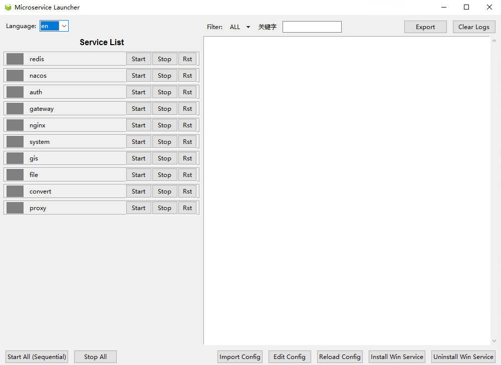

<div align="center">

# MicroService Launcher


GUI tool for launching and monitoring microservices on Windows, built with Python + Tkinter

[](https://www.python.org/)
[](#)
[](#)
[](#)

</div>

---

## Table of Contents
- [Overview](#overview)
- [Features](#features)
- [Requirements](#requirements)
- [Quick Start](#quick-start)
- [Service Configuration](#service-configuration)
- [Build EXE](#build-exe)
- [Run as Windows Service](#run-as-windows-service)
- [Screenshots](#screenshots)
- [Project Structure](#project-structure)
- [FAQ](#faq)

## Overview
MicroService Launcher provides a simple desktop GUI to orchestrate local microservices: start/stop, health checks, restart policy and log viewing. It is designed for multi-module projects on Windows.

Motivation: Our environment is primarily Windows due to historical reasons. Common Windows service tools lack solid support for “dependency-aware ordered startup” and “health-check waiting”. Inspired by Docker Compose, this tool adopts a declarative configuration to define dependencies and health checks, coupled with a minimal GUI for ordered startup and status visualization.

## Features
- Visual status: running, stopped, error, starting
- Ordered startup: respect dependencies and health checks
- Health checks: TCP port and HTTP endpoint
- Auto-restart: configurable attempts and intervals
- Logs: real-time collection, filtering, viewing and exporting; daily rotation, keep last 7 days

## Requirements
- Windows
- Python 3.12+
- Dependencies: psutil, requests, pywin32 (see [requirements.txt](file:///d:/research/microservice_launcher/requirements.txt))

## Quick Start
- Install dependencies

```bash
pip install -r requirements.txt
```

- Launch

```bash
python src/main.py
```

## Service Configuration
- Copy the example to your local config:
  - Copy [services.example.json](file:///d:/research/microservice_launcher/conf/services.example.json) to `conf/services.json`
- Example

```json
{
  "services": [
    {
      "service_name": "example-A",
      "command": "D:/path/to/start.bat",
      "working_dir": "D:/path/to",
      "environment": {
        "PORT": "8080",
        "DEBUG": "1"
      },
      "health_check_type": "port",          // port | http | none
      "health_check_config": {
        "host": "127.0.0.1",
        "port": 8080,
        "retries": 30,
        "interval": 1,
        "start_period": 5
      },
      "restart": "always",                  // always | unless-stopped | on-failure
      "max_restart_times": 5,
      "restart_interval": 3
    }
  ]
}
```

## Build EXE
- Use the script to create `dist/MicroServiceLauncher.exe`:
  - [build_exe.bat](file:///d:/research/microservice_launcher/scripts/build_exe.bat)

```bash
cd scripts
build_exe.bat
```

- Or manually with the existing spec:
  - [MicroServiceLauncher.spec](file:///d:/research/microservice_launcher/scripts/MicroServiceLauncher.spec)

```bash
pip install pyinstaller
pyinstaller --clean scripts/MicroServiceLauncher.spec
```

## Run as Windows Service
- Prepare NSSM in `scripts/` or in PATH
- Run as administrator:
  - Register: [register_service_nssm.bat](file:///d:/research/microservice_launcher/scripts/register_service_nssm.bat)
  - Unregister: [unregister_service_nssm.bat](file:///d:/research/microservice_launcher/scripts/unregister_service_nssm.bat)
- Defaults
  - Auto-detect `dist/MicroServiceLauncher.exe`
  - Service name `MicroserviceLauncher`, auto start
  - Logs to `logs/service_launcher_nssm.out.log` and `logs/service_launcher_nssm.err.log`
  - Working directory: project root, so `conf/services.json` can be read

## Screenshots
<p align="center">
  
</p>

## Project Structure
- Entry: [main.py](file:///d:/research/microservice_launcher/src/main.py)
- GUI: [gui.py](file:///d:/research/microservice_launcher/src/gui.py)
- Config: [config_manager.py](file:///d:/research/microservice_launcher/src/config_manager.py)
- Process: [process_manager.py](file:///d:/research/microservice_launcher/src/process_manager.py)
- Health: [health_checker.py](file:///d:/research/microservice_launcher/src/health_checker.py)
- Logs: [log_manager.py](file:///d:/research/microservice_launcher/src/log_manager.py)
- Ordering: [sequential_starter.py](file:///d:/research/microservice_launcher/src/sequential_starter.py)
- Service wrapper/monitor: [service_wrapper.py](file:///d:/research/microservice_launcher/src/service_wrapper.py), [service_monitor.py](file:///d:/research/microservice_launcher/src/service_monitor.py)

## FAQ
- Permissions
  - Ensure `command` points to an existing executable/script with proper permissions
- Health checks
  - Timeout is 5s; use `retries`, `interval` (supports fractional seconds) and `start_period` to control waiting and grace period
- Auto-restart
  - Controlled by `restart`, `max_restart_times`, `restart_interval`
- Log rotation
  - Daily rotation; keep last 7 days by default

---

For implementation details, browse [src](file:///d:/research/microservice_launcher/src/). Start with [main.py](file:///d:/research/microservice_launcher/src/main.py) and [gui.py](file:///d:/research/microservice_launcher/src/gui.py).
